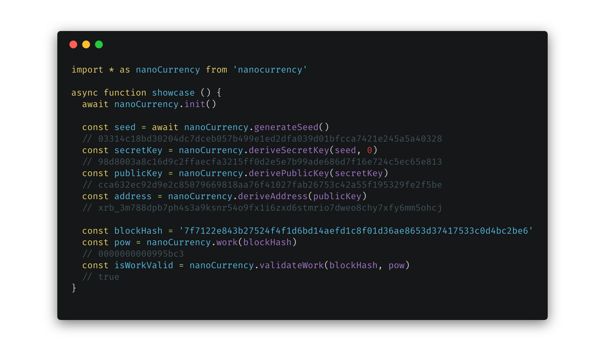

# nanocurrency-js

[](https://www.npmjs.com/package/nanocurrency)
[](https://travis-ci.org/marvinroger/nanocurrency-js)
[](https://github.com/semantic-release/semantic-release)
[](https://standardjs.com)

---

A toolkit for the Nano cryptocurrency, allowing you to derive keys, generate seeds, hashes, signatures, proofs of work and blocks.



The documentation is available in the [DOCUMENTATION.md](DOCUMENTATION.md) file.

---

## Usage

```
npm install nanocurrency
# or yarn add nanocurrency
```

## Contribute

Contributions are very welcome. To develop, make use of the following commands (using [Yarn](https://yarnpkg.com)):

* `yarn build:dev`: build the C++ code to WebAssembly and bundle the files into the `dist` directory, without optimization so that it is fast while developing

* `yarn test`: test the code

* `yarn lint`: lint the code against [JavaScript Standard Style](https://standardjs.com)

* `yarn generate-docs`: generate the `DOCUMENTATION.md` file from the [JSDoc](http://usejsdoc.org) annotations

---

## Helpful materials

* Article about seed / secret key / public key / address generation: https://medium.com/@benkray/raiblocks-deterministic-keys-8cb869cc6046

* BLAKE2 reference implementation, used for hashing: https://github.com/BLAKE2/BLAKE2

* Ed25519 portable implementation from Orson PETERS, used for keypair/signing: https://github.com/orlp/ed25519. **Note: The library has been modified to use BLAKE2b instead of SHA-512**

* tiny-bignum-c from kokke, used for amount representation: https://github.com/kokke/tiny-bignum-c

## Donations

If you like the project, feel free to donate some nano:

`xrb_3mrogerjhkdyj6mzf4e7aatf3xs3gp4stwc9yt9ymgasw7kr7g17t4jwwwy8`
