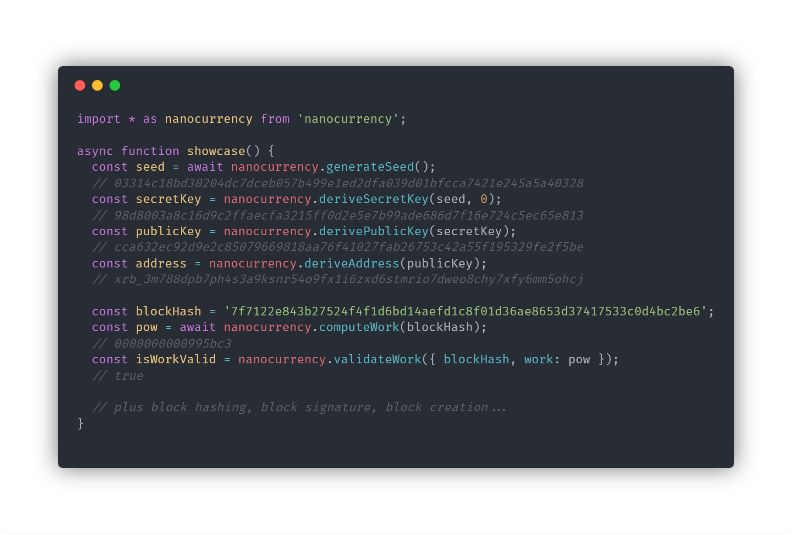

# nanocurrency-js

---

A toolkit for the Nano cryptocurrency.

---

## Helpful materials

* Article about seed / secret key / public key / address generation: https://medium.com/@benkray/raiblocks-deterministic-keys-8cb869cc6046

* BLAKE2 reference implementation, used for hashing: https://github.com/BLAKE2/BLAKE2

* Sodium crypto library, used for Ed25519 keypair/signing: https://github.com/jedisct1/libsodium
